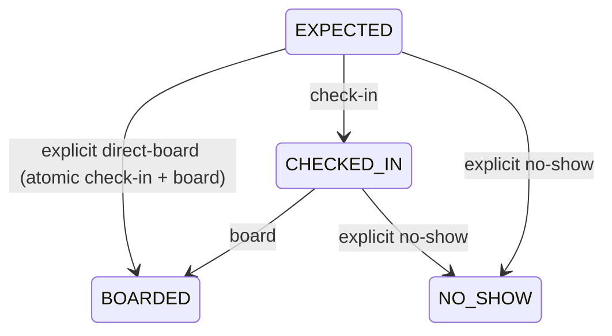

# M16B.1 + M16B.2 — Crew and boarding foundation

Operational employees are people doing transport work, independent of authenticated
`operator_staff` memberships and users. An employee needs no login account. Operator
admins manage employees and operations; staff can read owned employees, crew,
attendance, pickups and history. SYSTEM_ADMIN never obtains an operator context.
Customer credentials and public payment-link tokens cannot call these APIs. Staff
mutation capabilities remain deferred.

## Source audit and decisions

M16A PHONE bookings can lack a customer account. PENDING already reserves BOOKED
segment inventory, but only successful payment creates immutable tickets, one per
booking item. Attendance belongs to a booking item with an optional paid ticket;
unpaid booking items appear in the manifest and can receive explicit NO_SHOW. The
existing `/passengers` snapshot read remains compatible. The richer `/attendance`
read powers the existing Hành khách workspace with paid and unpaid rows.

The trip-first payment locking and existing bus scheduling guards are retained.
Trip lifecycle remains SCHEDULED → BOARDING → DEPARTED → COMPLETED. Operations use
READ_COMMITTED and trip row locks, preventing stale pre-lock snapshots during crew
conflict checks. JPA lifecycle mutations flush before same-transaction JDBC reads.
New writes share the existing transaction manager and database connection.

## Employees and crew

V12 is additive; V1–V11 are unchanged. `operator_employees` has operator ownership,
operator-unique code, name, phone, ACTIVE/INACTIVE status, timestamps and version.
`employee_capabilities` supports DRIVER and ATTENDANT together or separately.
`driver_profiles` stores licence number/class/expiry without claiming legal
compliance. Employee edits send the current version; stale edits reject. Codes are
trimmed. No employee deletion endpoint exists. Deactivation or removing a duty
capability rejects while unreleased SCHEDULED/BOARDING/DEPARTED assignments exist.
Released and historical assignments remain visible through history and storage.

Crew PUT expresses the complete desired active assignment set, with up to 20
entries. Multiple drivers and attendants are supported. Repeating the set creates
no extra history. Unchanged assignments retain IDs; removal records release
actor/time instead of deleting. A generated nullable active employee column
enforces one active assignment per trip/employee/duty while allowing reassignment
after release. Writes require SCHEDULED or BOARDING. During BOARDING, replacement
must leave a ready driver. Release on departed/completed trips is intentionally
unavailable in this milestone.

Lock order for crew/readiness is trip → bus → all affected employee rows in
ascending employee ID order. Every overlap query runs after employee locking:
`newStart < existingEnd AND newEnd > existingStart`. The interval is planned trip
departure to estimated arrival. SCHEDULED, BOARDING and DEPARTED unreleased
assignments conflict; completed/cancelled trips do not. Adjacent intervals and
different employees can succeed. Employee directory writes lock the operator then
employee, and never lock trips. Existing bus overlap checks are unchanged.

Entering BOARDING requires an AVAILABLE, undeleted bus with active type, at least
one ACTIVE assigned DRIVER with DRIVER capability, valid licence through the
later of the Vietnam planned end date and current operation date, and no conflict
or invalid crew assignment. Readiness is displayed in Overview; missing/expired/
conflicting crew rejects the lifecycle command. Licence class is reference data.

## Attendance and pickup operations

V13 extends the legacy `ticket_boarding` table with a unique non-null
`booking_item_id` and nullable unique `ticket_id`. Existing attendance rows are
linked through their tickets; no passenger states are backfilled. A database check
requires ticketless attendance to be NO_SHOW. New payment-issued tickets get EXPECTED in
the payment transaction; no historical tickets are backfilled. Missing records
display **Chưa ghi nhận**, and lazily become operational records on an explicit
command. EXPECTED also displays Chưa ghi nhận.

The UI uses check-in then board. Direct-board is an explicit API command, records
both check-in and board history, and is atomic. Repeating the committed target
state returns its existing timestamps and produces no extra events, including
after pickup closure. Different commands cannot overwrite BOARDED or NO_SHOW.

Commands validate operator, trip, ticket, booking/item/seat/payment relationships,
CONFIRMED/COMPLETED commercial booking and PAID ticket payment, plus the exact
booked pickup stop. Current tickets are immutable issued artifacts and have no
void status/void API; cancelled bookings or refunded payments fail eligibility.
Ticket voiding, cancellation and refund are outside this milestone.

All writes take the owned trip lock first. This serializes ticket actions, pickup
closure, lifecycle completion and existing payment confirmation. Boarding cannot
race past closure, and completion cannot race past unresolved passengers.

An open pickup accepts attendance during BOARDING; after DEPARTED only an
intermediate booked pickup accepts it. Origin is the first snapshot stop by order,
not the first passenger's stop. There is no automatic time cutoff or invented
arrival tracking. Planned pickup time is shown as an advisory warning. Actual
boarding records the booked stop, actor and time.

Pickup closure is explicit and permanent in this milestone. Open is represented
by the absence of a closure row; `(trip_id, stop_id)` uniquely identifies a closed
pickup. Closure rejects if any valid booking item at that stop has no terminal
BOARDED/NO_SHOW attendance, including unpaid PENDING items without tickets. The
operator collects arrivals through M16A before check-in/boarding, or explicitly
marks absent unpaid PHONE PAY_ON_BOARD booking items NO_SHOW without payment.
Closure never silently creates no-shows. Origin closure is required before
DEPARTED. Every ACTIVE pickup-enabled snapshot stop, including empty pickups,
must be closed before COMPLETED; no unresolved valid passenger may remain.

NO_SHOW stores actor/time and booked pickup context with append-only history. It
does not cancel/refund, free inventory, change payment, or modify booking status.
Unpaid passengers cannot check in or board. The booking-item no-show command
requires a valid PENDING PHONE PAY_ON_BOARD reservation and its exact pickup.
It records BOOKING_ITEM history, no ticket or payment, and retains all BOOKED
inventory and commercial booking/history fields. Duplicate no-show is idempotent,
including after closure. NO_SHOW is terminal: new full-booking payment rejects
BOOKING_ATTENDANCE_TERMINAL if any passenger in that booking is NO_SHOW. Other
passengers may also be explicitly marked absent. There is no partial payment.
Payment/no-show races share the trip lock: payment first produces a paid ticket
whose no-show follows existing ticket behavior; no-show first blocks payment.
Already successful paid payment retries keep their existing idempotent behavior.

## Payment and UI

**Ghi nhận đã thu tiền** reuses the M16A full-booking payment command. The manifest
confirmation names the booking and total amount, including all its seats. After
collection, ticket rows enable check-in/board. Only authenticated PHONE collection
extends to DEPARTED at an open intermediate pickup. Origin after departure and
closed pickups reject new collection; customer/anonymous confirmation retains
its existing time/lifecycle restriction. Repeating successful payment remains
idempotent. Payment and attendance stay separate.

Navigation adds **Nhân sự vận hành** with code, name, phone, status, capabilities
and licence expiry. Create/edit conditionally requires licence fields for DRIVER.
Overview adds crew, readiness and assignment/removal controls. Hành khách shows
one row per booking item with seat, passenger/contact fallback, authorized phone,
pickup/dropoff, intended method, payment and boarding state. Compact filters cover
all, unrecorded, checked-in, boarded, no-show, pickup and unpaid, with search.
Collection, no-show and pickup closure show explicit confirmation. Admin-only
controls are absent for staff. Existing seat/occupancy/customer screens retain
their behavior.

## History, demo and limits

`operational_history` is the append-only domain history for crew assignment/release,
check-in, board, no-show, pickup closure and lifecycle transitions. It records trip,
entity type/ID, action, user actor, time and optional reason. No operational API
updates/deletes history, and generic events store no customer name/phone. Attendance
timestamps and assignment release records remain authoritative current domain state.

Demo seed creates deterministic DEMO-DRIVER and DEMO-ATTENDANT employees for An Phú
only if absent, preserving all edited fields. Only newly created demo trips may
receive eligible non-overlapping crew, with history; existing trips, assignments,
bookings and tickets are never rewritten. Existing reserved employee codes are
treated as existing records; their capabilities/status/licence are revalidated.

Deferred: staff mutation capabilities, camera QR scanning, driver mobile app,
cancellation/refunds, seat changes/rescheduling, payroll, GPS, rest-rule/legal
optimization, actual-arrival tracking, licence-history snapshots and
reversal/reopening of attendance/pickup closure. Commercial cancellation/refund
remains M17; attendance never releases inventory.
